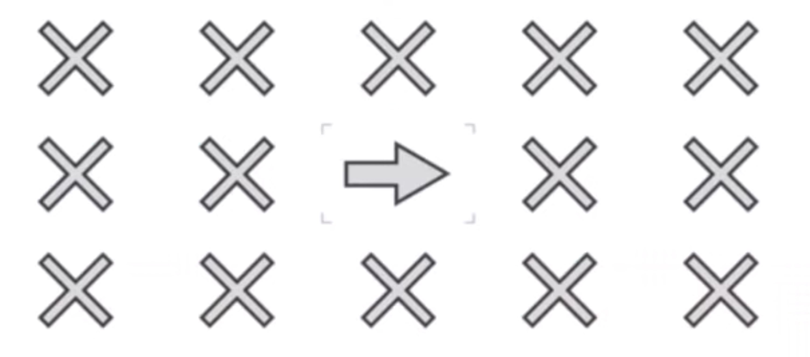

# Arctic Shores Simulator

The purpose of this project is simply to in some small way reproduce a couple of the Arctic Shores gamified assessment 'games' for practice and to level out the playing field slightly between those that have passed through them before and those coming across them for the first time.

## Direction game

This game involves pressing `p` or `q` depending on the direction of the central arrow. The basic concept is very simple, involves very little brain processing but very quick reactions. An odd test given how vastly it favours young people rather than any particular brain or personality type. Useful in differentiating between a group of 'twenty somethings' maybe. Not surprisingly, I was terrible at this.

|  |
| ---------------------------------------------------------------------------------------------------- |

A video clip of the Arctic Shores direction game simulation can be found [here](https://drive.google.com/file/d/1xRBWIvMDb0Tl9H8f3r0BI5S7_MCh_m4a/view?usp=drive_link).

## Direction game

This game involves pressing `p` or `q` depending on the number or shape and whether it is in the top or bottom 'ticket'. This is a more brain taxing but slower version of the direction game. Not favouring the young quite as badly and having some cognition merit at least.

|  |
| ------------------------------------------------------------------------------------------------- |

A video clip of the Arctic Shores ticket game simulation can be found [here](https://drive.google.com/file/d/1WiPDvowtekh2BBt692ft5kYUm69lMs7a/view?usp=sharing).
